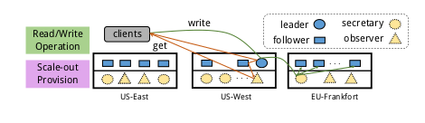
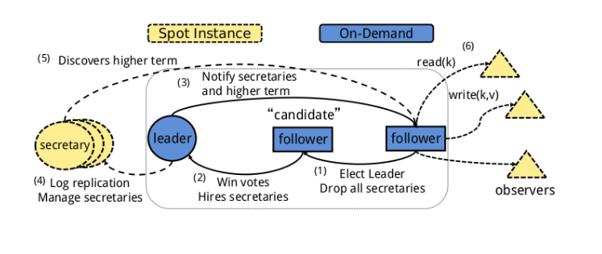
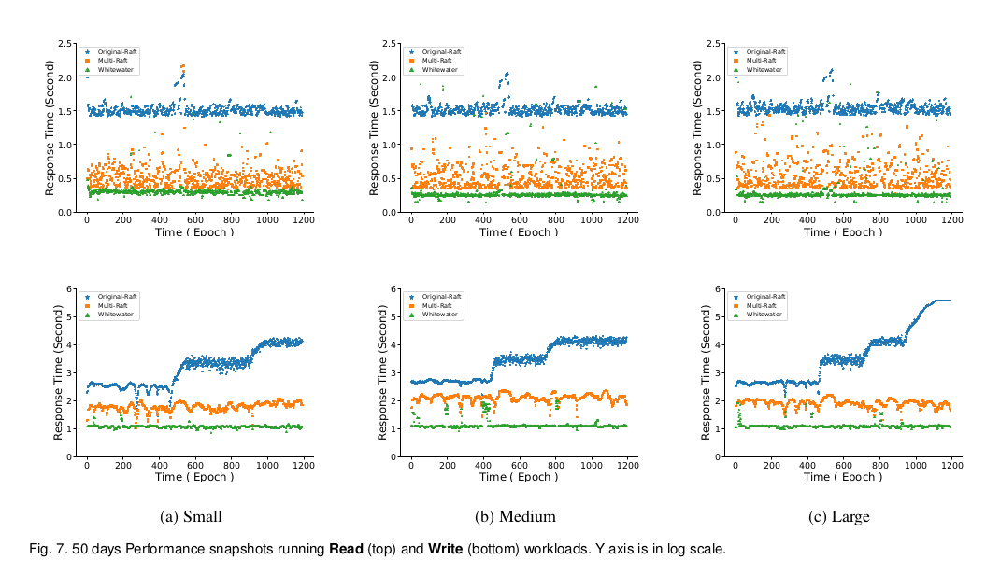

####　Whitewater: Elastic Data Consistency on Geo-diverse Data Replicas

 **Abstract:**

Raft is a protocol to maintain strong consistency across data replicas in cloud. It is widely used, especially by workloads that span geographically distributed sites. As these workloads grow, Raft’s costs should grow, as least proportionally. However, auto scaling approaches for Raft inflate costs by provisioning at all sites when one site exhausts its local resources. So we presents Whitewater, a scale-out mechanism that enables precise auto scaling for Raft. Whitewater extends Raft with the following abstractions: (1) secretaries which takes log processing for the leader and (2) observers which process read requests for followers. These abstractions are stateless, allowing for elastic auto scaling, even on unreliable spot instances. Whitewater provably preserves strong consistency guarantees provided by Raft. We implemented and evaluated Whitewater with multiple auto scaling techniques on Amazon EC2. Geo- Raft scales in resource footprint increments 5-7X smaller than Multi-Raft, the state of the art. Using spot instances, Whitewater reduces costs by 84.5% compared to Multi-Raft. Whitewater improves goodput of 95th-percentile SLO by 9X.

**The Architecture of WhiteWater:**

**The state machine and stateless nodes in Whitewater.**

**Some  Performance Results:**

